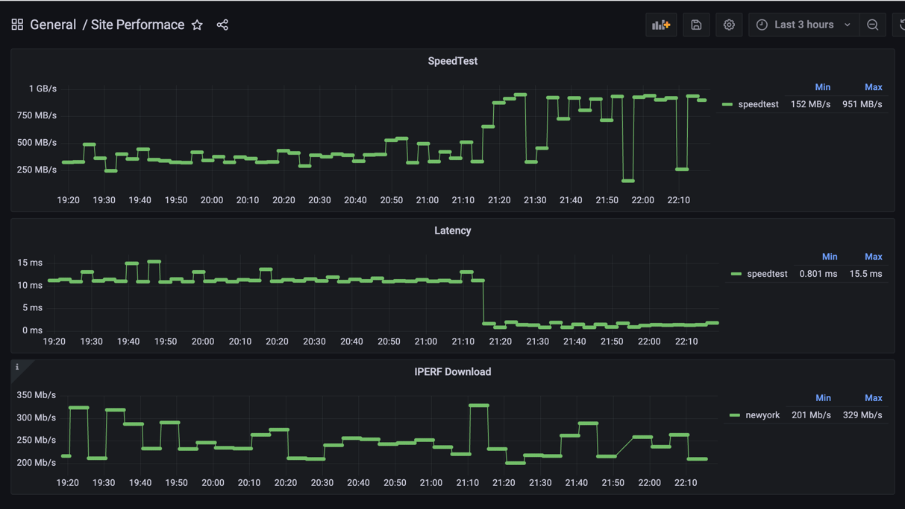

# effective-spork 
This repository is a basic IaC to execute common performance testing and produce monitoring output.

This is intended to servre 

### docker-compose.yml
- File the downloads & orchestrates the build of several docker images that make up the services
  - speedtest 
  - iperf
  - iperf_exporter 
  - prometheus 
  - grafana 

### Python 
getPublicIP.py - Simple script that runs a query for the public IP of the machine and insert it into a YAML file.  
render.py - Takes the performance.yml and prometheus.j2 files and produces the prometheus.yml file. This is done so the 
amount of job can be listed in a shorter yaml file and the text of the config can be rendered 

### requirements 
modules , packages needed to download to orchestrate this build 

### setup.sh 
Shell Script that kicks off a number of the functions to limit key stroke input. 

### grafana_dashboard.json
a json file of the pre-canned dashboard 

